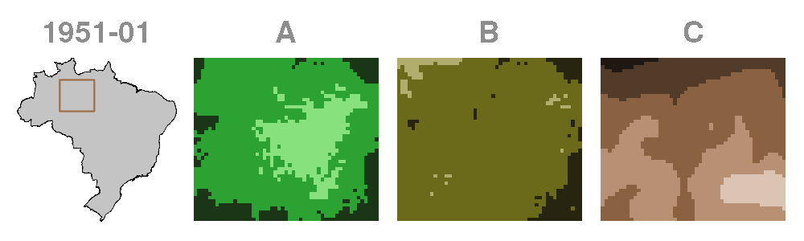

# Logônia 

<!-- badges: start -->
[](https://www.repostatus.org/#active)
[](https://doi.org/10.5281/zenodo.21332539)
[](https://www.comses.net/codebases/4f2be13a-3957-4537-bf64-3fad96ba271f/)
[](https://github.com/sustentarea/logonia/actions)
[](https://fairsoftwarechecklist.net/v0.2?f=31&a=30113&i=32300&r=123)
[](https://fair-software.eu)
[](https://www.gnu.org/licenses/gpl-3.0)
[](https://www.contributor-covenant.org/version/3/0/code_of_conduct/)
<!-- badges: end -->

## Overview

`Logônia` is a [NetLogo](https://www.netlogo.org) model that simulates the growth response of a fictional plant, Logônia, under different climatic conditions. The model uses climate data from [WorldClim 2.1](https://worldclim.org/) and demonstrates how to integrate the [`LogoClim`](https://github.com/sustentarea/logoclim) model through the [`LevelSpace`](https://ccl.northwestern.edu/netlogo/docs/ls.html) extension.

> If you find this project useful, please consider giving it a star! [](https://github.com/sustentarea/logonia/)

<p align="center">
  
</p>

## How It Works

`Logônia` runs on a grid of patches, where each patch represents a piece of soil that can host a plant. Patches correspond to a specific geographic area and store historical climate data.

Each simulation step represents *one month*. Over time, plants *grow*, *reproduce*, and *age*. These processes are controlled by sliders in the model interface. Climate conditions directly influence growth probability, adding realism and complexity to the simulation.

<p align="center">
  
</p>

### Climate Data

The model uses *Historical Monthly Weather Data* from [WorldClim 2.1](https://worldclim.org/) for a region of the **Brazilian Amazon Forest**.

This dataset provides 12 monthly values per year for 1951-2024, based on [downscaled](https://worldclim.org/data/downscaling.html) data from [CRU-TS-4.09](https://crudata.uea.ac.uk/cru/data/hrg/cru_ts_4.09/), developed by the [Climatic Research Unit](https://www.uea.ac.uk/groups-and-centres/climatic-research-unit) at the [University of East Anglia](https://www.uea.ac.uk/) ([Harris et al., 2020](https://doi.org/10.1038/s41597-020-0453-3)). The variables are: (**A**) *Average Minimum Temperature (°C)*, (**B**) *Average Maximum Temperature (°C)*, and (**C**) *Total Precipitation (mm)*.

<p align="center">
  
</p>

The dataset can be reproduced using a [Quarto](https://quarto.org/) notebook in the `qmd` folder of the model code repository.

### Energy and Growth Probability

Growth probability is determined by a [logistic regression](https://en.wikipedia.org/wiki/Logistic_regression) model that incorporates patch-level climate variables. The probability follows the equation below:

$$
p(\text{tmin, tmax, prec}) = \cfrac{1}{1 + e^{- (\beta_{0} + \beta_{\text{tmin}} \text{tmin} + \beta_{\text{tmax}} \text{tmax} + \beta_{\text{prec}} \text{prec})}}
$$

A Logônia gains or loses energy at each step according to the following rules:

- If a random number between `0` and `1` is *less than* or *equal to* the growth probability for the current patch, the plant gains the number of energy points defined by the `energy-gain` slider.
- If the probability is *below* `0.25` and does not meet the above condition, the plant loses `1` energy point.
- Otherwise, its energy remains unchanged.

If a plant gets to `0` points of energy it dies.

### Growth Phases

A Logônia plant develops through three phases: *seedling*, *juvenile*, and *adult*. Each has distinct shapes and energy thresholds.

<p align="center">
  
</p>

As a *seedling*, the Logônia can only grow and age. Once it accumulates `10` energy points, it becomes a *juvenile*.

As a *juvenile*, it continues to grow and age. When it reaches `30` energy points, it advances to its final stage: an *adult*.

As an *adult*, the Logônia gains the ability to reproduce.

### Reproduction

Adult plants can reproduce asexually by randomly colonizing unoccupied patches:

- If an adult has at least `30` energy points, and a random number between `0` and `1` is *less than* or *equal to* the `reproduction-rate` slider, a new seedling is created in a randomly selected patch with `0` age and `1` point of energy.
- If the selected patch is already occupied, the seedling dies immediately.

When a Logônia occupy a patch, the patch color changes to brown to indicate it was once taken.

### Senescence

Plants age by `1` month per step. Age is shown by color, fading from lime to brown. They die when they reach their maximum age of `100` months or run out of energy.

<p align="center">
  
</p>

## Usage

> Click [here](https://youtube.com/playlist?list=PL1CZfe9j9vWFY1U0YCzdVvGFDEFzf2NO4&si=fxaLGQnBcx180eNL) to see a showcase of the model.

To get started using `Logônia`, you must have [NetLogo](https://www.netlogo.org) installed. The model was developed with NetLogo 7.0.4. Use this version or newer for best compatibility. The NetLogo [website](https://www.netlogo.org) provides easy installers for Windows, macOS, and Linux, along with detailed instructions for installation.

The model relies on the NetLogo extensions [`LevelSpace`](https://ccl.northwestern.edu/netlogo/docs/ls.html) and [`String`](https://github.com/NetLogo/String-Extension). These extensions are installed automatically when the model is run for the first time.

With NetLogo ready, follow these steps to get `Logônia` up and running.

### A. Download the Model

You can download the latest release of the model from the [CoMSES Network](https://www.comses.net/codebases/4f2be13a-3957-4537-bf64-3fad96ba271f/). This is the recommended option for most users, as it provides a stable version of the model that has been tested and documented.

For the development version, you can clone or download the model [GitHub code repository](https://github.com/sustentarea/logonia/) directly.

### B. Run the Model

Once everything is set, click on the **`Setup`** and then **`Go`** buttons to start the simulation.

Refer to the `Info` tab in the model for additional details.

## Contributing

[](https://www.contributor-covenant.org/version/3/0/code_of_conduct/)

Contributions are always welcome, whether that's reporting bugs, suggesting features, or improving the code or documentation.

Before opening a new issue, please check the [issues tab](https://github.com/sustentarea/logoclim/issues) to see if your topic has already been reported.

## Citation

[](https://doi.org/10.5281/zenodo.21332539)

To cite `Logônia` please use the following format:

Vartanian, D., Garcia, L., & Carvalho, A. M. (2026). *Logônia: Plant growth response model in NetLogo* \[Computer software\]. Zenodo. <https://doi.org/10.5281/zenodo.21332539>

A BibLaTeX entry for LaTeX users is:

``` latex
@software{vartanian2026,
  title = {Logônia: Plant growth response model in NetLogo},
  author = {{Daniel Vartanian} and {Leandro Garcia} and {Aline Martins de Carvalho}},
  year = {2026},
  doi = {10.5281/zenodo.21332539},
  publisher = {Zenodo}
}
```

## License

[](https://www.gnu.org/licenses/gpl-3.0)

``` text
Copyright (C) 2026 Sustentarea Research and Extension Center

Logônia is free software: you can redistribute it and/or modify it under the
terms of the GNU General Public License as published by the Free Software
Foundation, either version 3 of the License, or (at your option) any later
version.

This program is distributed in the hope that it will be useful, but WITHOUT ANY
WARRANTY; without even the implied warranty of MERCHANTABILITY or FITNESS FOR A
PARTICULAR PURPOSE. See the GNU General Public License for more details.

You should have received a copy of the GNU General Public License along with
this program. If not, see <https://www.gnu.org/licenses/>.
```

## Acknowledgments

We gratefully acknowledge [Robert J. Hijmans](https://orcid.org/0000-0001-5872-2872), [Stephen E. Fick](https://orcid.org/0000-0002-3548-6966), and the entire [WorldClim](https://worldclim.org/) team for their outstanding work in creating and maintaining the WorldClim datasets.

We thank the [Climatic Research Unit](https://www.uea.ac.uk/groups-and-centres/climatic-research-unit) at the [University of East Anglia](https://www.uea.ac.uk/) and the United Kingdom's [Met Office](https://www.metoffice.gov.uk/) for developing and providing access to the [CRU-TS-4.09](https://crudata.uea.ac.uk/cru/data/hrg/cru_ts_4.09/) dataset, a vital source of historical climate data.

We also acknowledge the World Climate Research Programme ([WCRP](https://www.wcrp-climate.org/)), its Working Group on Coupled Modelling, and the Coupled Model Intercomparison Project Phase 6 ([CMIP6](https://pcmdi.llnl.gov/CMIP6/)) for coordinating and advancing global climate model development.

We are grateful to the climate modeling groups for producing and sharing their model outputs, the Earth System Grid Federation ([ESGF](https://esgf.llnl.gov/)) for archiving and providing access to the data, and the many funding agencies that support [CMIP6](https://pcmdi.llnl.gov/CMIP6/) and [ESGF](https://esgf.llnl.gov/).

<table>
  <tr>
    <td width="30%" valign="center">
      <p align="center">
        <a href="https://www.fsp.usp.br/sustentarea/">
          
        </a>
      </p>
    </td>
    <td width="70%" valign="center">
      <p>
        This work was supported by the
        <a href="https://www.fsp.usp.br/sustentarea/">Sustentarea</a>
         Research and Extension Center at the University of São Paulo (<a href="https://www5.usp.br/">USP</a>).
      </p>
    </td>
  </tr>
</table>

<table>
  <tr>
    <td width="30%" valign="center">
      <p align="center">
        <a href="https://resiclima.com.br/">
          
        </a>
      </p>
    </td>
    <td width="70%" valign="center">
      <p>
        This work was supported by the <a href="https://resiclima.com.br/">Resiclima Network</a>, an international collaboration for the multidimensional and
        interdisciplinary study of global climate change.
      </p>
    </td>
  </tr>
</table>

<table>
  <tr>
    <td width="30%" valign="center">
      <p align="center">
        <a href="https://www.gov.br/cnpq/">
          
        </a>
      </p>
    </td>
    <td width="70%" valign="middle">
      <p>
        This work was supported by the National Council for Scientific and Technological Development (<a href="https://www.gov.br/cnpq/">CNPq</a>) of the Ministry of Science, Technology and Innovation (<a href="https://www.gov.br/mcti/">MCTI</a>) of Brazil and by the Department of Science and Technology (<a href="https://www.gov.br/saude/pt-br/composicao/sectics/decit/">DECIT</a>) of the Secretariat of Science, Technology, Innovation and Strategic Health Inputs (<a href="https://www.gov.br/saude/pt-br/composicao/sectics/">SECTICS</a>) of the Ministry of Health (<a href="https://www.gov.br/saude/">MS</a>) of Brazil, through Call <a href="https://www.gov.br/cnpq/pt-br/chamadas/todas-as-chamadas/chamadas-2023/chamada-ndeg-18-2023/chamada-publica-cnpq-decit-sectics-ms-ndeg-18-2023-ciencia-de-dados-mudancas-climaticas-e-impactos-para-a-saude">CNPq/DECIT/SECTICS/MS No. 18/2023</a> (No. 444588/2023-0).
      </p>
    </td>
  </tr>
</table>
